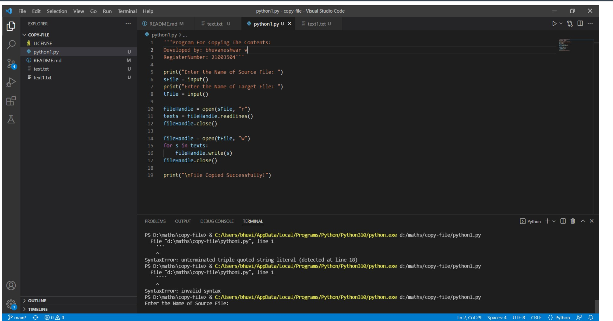
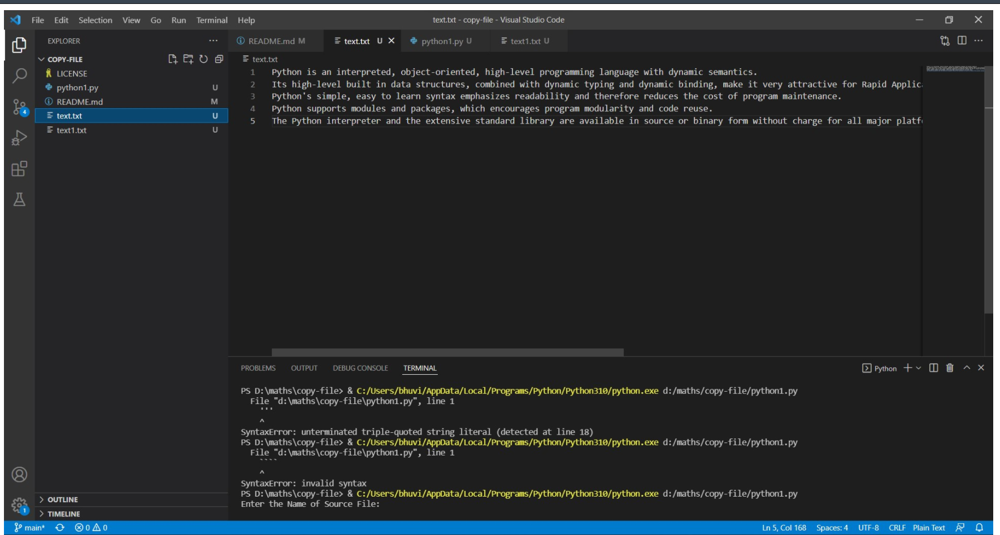
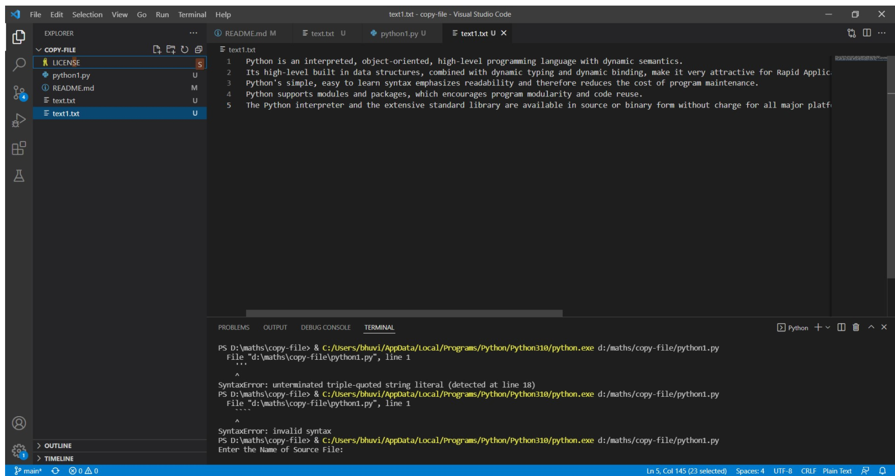

# copy-file
## AIM:
To write a python program for copying the contents from one file to another file.
## EQUIPEMENT'S REQUIRED: 
PC
Anaconda - Python 3.7
## ALGORITHM: 
### Step 1:

### Step 2: 
 
### Step 3: 

### Step 4:  

### Step 5: 

### Step 6: 

## PROGRAM:
```
print("Enter the Name of Source File: ")
sFile = input()
print("Enter the Name of Target File: ")
tFile = input()

fileHandle = open(sFile, "r")
texts = fileHandle.readlines()
fileHandle.close()

fileHandle = open(tFile, "w")
for s in texts:
    fileHandle.write(s)
fileHandle.close()

print("\nFile Copied Successfully!")
```
### OUTPUT:





## RESULT:
Thus the program is written to copy the contents from one file to another file.